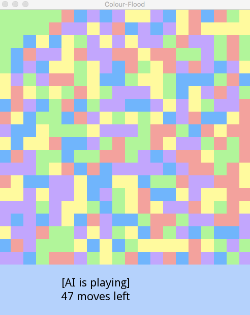

The game has two modes: AI and User. (The GIF above shows the former)

In AI mode, game is running automaticaly. 

In user mode, the player is free to click on any colour and suggestion given by AI is shown.

## Building:

SDL2 Dynamic-link library required for building.

You may download it from [here](https://www.libsdl.org/download-2.0.php "SDL2")

### Enter the folder named build

 
	cd build

### Generate MakeFile using cmake

	cmake ..

### Build by make

	make

## Running the program:

	./colour_flood [MaxMoves] [GridSize] [AI]
	
For example, 
the following command initializes a game with 20 x 20 grids and at most 100 moves are allowed for AI to make.

	./colour_flood 100 20 AI
	
while,

	./colour_flood 50 15	
	
initializes a game with 15 x 15 grids and the player must flood it within 50 moves.
	
	
